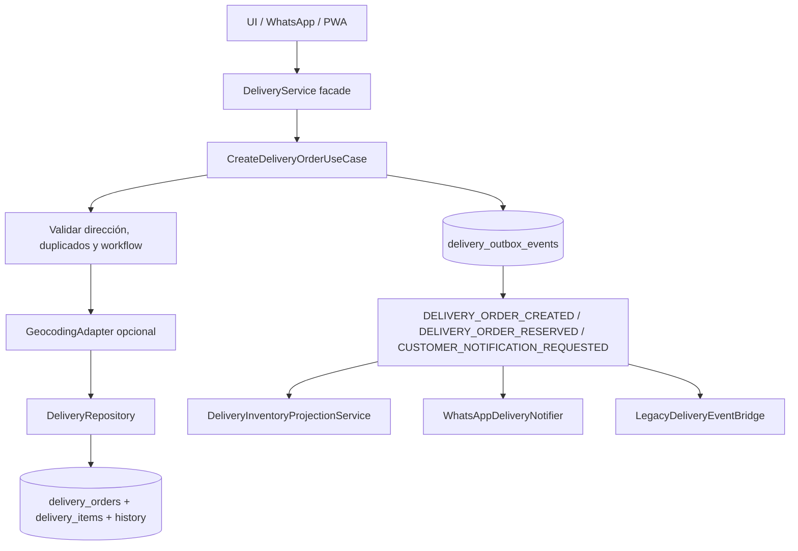
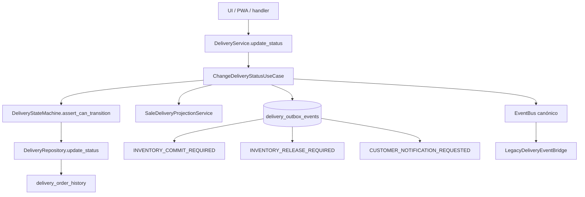
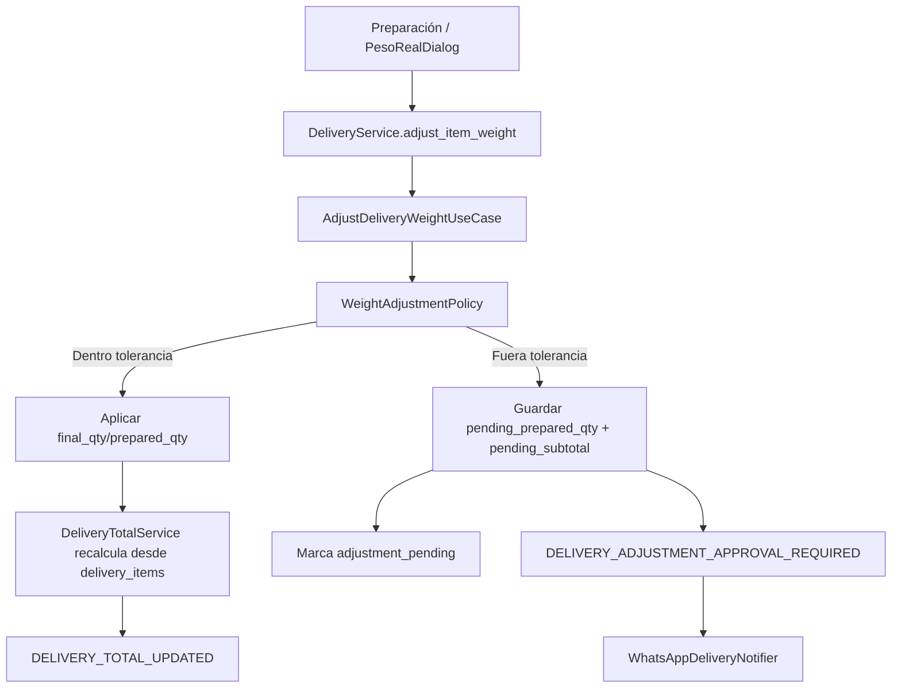

# Delivery Architecture — Fase 14

Este documento describe el estado objetivo incremental del bounded context `core/delivery` después de las fases 0–13. La arquitectura es pragmática: mantiene compatibilidad con `core/services/delivery_service.py` y la UI actual, pero mueve decisiones de negocio a dominio/application y efectos secundarios a outbox/proyecciones/adapters.

## Objetivos de arquitectura

- `delivery_orders.estado` es la fuente de verdad del estado logístico.
- `ventas.estado` y `ventas.total` son proyecciones comerciales controladas por `SaleDeliveryProjectionService`.
- `delivery_items` son items operativos/preparación; `detalles_venta` conservan el detalle comercial/fiscal.
- La UI no decide reglas de transición: solicita acciones válidas a `DeliveryService.get_valid_actions()`, que delega en `DeliveryStateMachine`.
- Inventario, WhatsApp y efectos críticos se disparan por eventos canónicos y outbox transaccional cuando aplica.
- Los eventos legacy siguen vivos solo mediante `LegacyDeliveryEventBridge` durante la migración.

## Mapa de módulos

```text
core/delivery/
  domain/              # puro: estados, entidades, policies, state machine, eventos
  application/         # casos de uso: crear, cambiar estado, ajustar peso, outbox, sync WA
  infrastructure/      # SQLite migrator, outbox repository, adapters WA/inventario
  projections/         # ventas e inventario como efectos secundarios controlados

core/services/
  delivery_service.py  # fachada legacy compatible hacia use cases
  order_total_service.py # shim hacia DeliveryTotalService

repositories/
  delivery_repository.py # persistencia delivery; schema delegado a migrator
```

## Flujo: crear pedido



Reglas clave:

1. La dirección es obligatoria para pedidos de entrega a domicilio.
2. Geocoding es opcional y no debe bloquear la creación si falla de forma no crítica.
3. La deduplicación se hace por `whatsapp_order_id` o `venta_id` cuando el origen es WhatsApp/venta existente.
4. Los eventos críticos se encolan sin `db` en payload.

## Flujo: cambiar estado



Reglas clave:

- `programado` no avanza a `preparacion`, `en_ruta` o `entregado` sin activarse.
- `counter` no puede ir a `en_ruta`; puede pasar de `preparacion` a `entregado` con responsable.
- Delivery a domicilio debe pasar por `en_ruta` antes de `entregado`.
- `entregado` requiere responsable.
- `en_ruta` y `entregado` se bloquean si hay ajuste pendiente de cliente.
- `entregado` no regresa a estados previos sin proceso explícito de reverso.

## Flujo: ajuste de peso



Reglas clave:

- Dentro de tolerancia: se actualiza item, se recalcula `delivery_orders.total`, se emite `DELIVERY_TOTAL_UPDATED`.
- Fuera de tolerancia: no se aplica el total real hasta aceptación del cliente; se guarda cantidad/subtotal pendiente.
- Aceptación: aplica cantidad pendiente, recalcula total y proyecta a ventas.
- Rechazo: conserva cantidad/subtotal original y desbloquea según política.

## Tabla de estados

| Estado canónico | Significado | Legacy normalizado | Acciones principales |
| --- | --- | --- | --- |
| `pendiente` | Pedido creado, aún no preparado. | `pendiente_wa` | Preparar, cancelar, ver detalle. |
| `preparacion` | Pedido en surtido/preparación. | `asignado`, `listo`, `en_preparacion` | Ajustar peso, asignar, enviar a ruta, entregar si `counter`, cancelar. |
| `en_ruta` | Pedido salió con repartidor. | `en_camino` | Entregar, notificar. |
| `entregado` | Pedido finalizado logísticamente. | `entregada` | Imprimir/ver; reverso explícito pendiente. |
| `cancelado` | Pedido cancelado. | `cancelada` | Reactivar a pendiente si política lo permite. |
| `programado` | Pedido reservado para ventana futura. | `scheduled` | Activar, reprogramar, cancelar. |

## Tabla de eventos canónicos

| Evento | Crítico/outbox | Payload mínimo | Consumidores esperados |
| --- | --- | --- | --- |
| `DELIVERY_ORDER_CREATED` | No siempre | `order_id`, `folio`, `direccion`, `total`, `sucursal_id`, `usuario` | UI, bridge legacy, analytics. |
| `DELIVERY_ORDER_RESERVED` | Sí operacional | `order_id`, `operation_id`, `items`, `branch_id` | Inventario/reservas. |
| `DELIVERY_ORDER_PREPARING` | No | `order_id`, `folio`, `usuario`, `sucursal_id` | UI/notificaciones internas. |
| `DELIVERY_DRIVER_ASSIGNED` | No | `order_id`, `driver_id`, `driver_nombre`, `tiempo_estimado` | UI/PWA/repartidores. |
| `DELIVERY_OUT_FOR_DELIVERY` | No/WA | `order_id`, `driver_id`, `folio`, `cliente_tel` | WhatsApp, bridge legacy, UI. |
| `DELIVERY_ORDER_DELIVERED` | Sí | `order_id`, `folio`, `driver_id`, `total`, `sucursal_id`, `responsable` | Inventario commit, finanzas/caja, bridge legacy. |
| `DELIVERY_ORDER_CANCELLED` | Sí | `order_id`, `folio`, `usuario`, `motivo` | Inventario release, UI, ventas projection. |
| `DELIVERY_ADJUSTMENT_APPROVAL_REQUIRED` | Sí | `order_id`, `item_id`, `folio`, `cliente_tel`, `requested_qty`, `prepared_qty`, `new_subtotal` | WhatsApp/customer approval. |
| `DELIVERY_ITEM_WEIGHT_ADJUSTED` | No | `order_id`, `item_id`, `requested_qty`, `prepared_qty`, `new_total` | Totales/UI. |
| `DELIVERY_TOTAL_UPDATED` | No/operacional | `order_id`, `old_total`, `new_total`, `folio`, `cliente_tel` | Ventas projection, pagos. |
| `INVENTORY_COMMIT_REQUIRED` | Sí | `order_id`, `operation_id`, `items`, `sucursal_id` | Inventario físico. |
| `INVENTORY_RELEASE_REQUIRED` | Sí | `order_id`, `operation_id`, `reason` | Reservas/inventario. |
| `CUSTOMER_NOTIFICATION_REQUESTED` | Sí | `order_id`, `canal`, `template`, `params`, `cliente_tel` | Notifier WhatsApp/SMS. |
| `DELIVERY_SCHEDULED_ORDER_ACTIVATED` | No | `order_id`, `workflow_type`, `usuario`, `sucursal_id` | UI, ventas projection, WA. |

## Fuente de verdad

| Dato | Fuente canónica | Proyección / compatibilidad |
| --- | --- | --- |
| Estado logístico | `delivery_orders.estado` | `ventas.estado` vía `SaleDeliveryProjectionService`. |
| Total operativo delivery | `delivery_orders.total`, calculado desde `delivery_items` | `ventas.total` vía proyección cuando aplica. |
| Items preparación | `delivery_items` | `detalles_venta` no debe ser mutado por preparación. |
| Historial auditable | `delivery_order_history` | `delivery_orders.historial_cambios` deprecated temporal. |
| Efectos críticos | `delivery_outbox_events` | `EventBus` solo como canal en memoria/compatibilidad. |

## Integración con ventas

`SaleDeliveryProjectionService` encapsula el mapping logístico → comercial:

| Delivery | Ventas |
| --- | --- |
| `pendiente` | `pendiente_wa` |
| `preparacion` | `en_preparacion` |
| `en_ruta` | `en_ruta` |
| `entregado` | `entregada` |
| `cancelado` | `cancelada` |

Regla: `DeliveryRepository` persiste delivery; no debe actualizar `ventas` directamente en nuevos flujos.

## Integración con inventario

- Puerto: `InventoryReservationPort`.
- Adapter actual: `ReservationServiceInventoryAdapter` sobre `ReservationService` legacy.
- Proyección: `DeliveryInventoryProjectionService` procesa `DELIVERY_ORDER_RESERVED`, `INVENTORY_RELEASE_REQUIRED` e `INVENTORY_COMMIT_REQUIRED`.
- Idempotencia:
  - Orden: `delivery:{order_id}`.
  - Item commit: `delivery:{order_id}:item:{item_id}:commit`.
- En entrega, commit usa `final_qty` o `prepared_qty` si existen; no debe descontar cantidad solicitada si hubo ajuste aplicado.

## Integración con WhatsApp

- Puerto: `DeliveryNotifierPort`.
- Adapter actual: `WhatsAppDeliveryNotifier`.
- Evento de salida: `CUSTOMER_NOTIFICATION_REQUESTED`.
- `DeliveryWhatsAppService` permanece como fachada legacy y delega templates al notifier.
- Los mensajes largos/templates viven en el notifier, no en dominio ni casos de uso principales.

## Política de outbox

Tabla: `delivery_outbox_events`.

Campos clave:

- `event_type`
- `aggregate_type = delivery_order`
- `aggregate_id`
- `payload_json`
- `operation_id`
- `status = pending|done`
- `retries`
- `last_error`
- `created_at`, `processed_at`

Reglas:

1. Eventos críticos se insertan en la misma transacción del cambio de estado/ajuste.
2. Payloads no pueden incluir `db` ni objetos no serializables.
3. `operation_id` evita duplicados.
4. `ProcessDeliveryOutboxUseCase` procesa pendientes, marca `done` o incrementa retry/error.
5. EventBus en memoria no es fuente de confiabilidad para inventario/notificaciones críticas.

## Compatibilidad legacy

- `DeliveryService` mantiene API legacy: `create_order`, `update_status`, `adjust_item_weight`, `list_orders` y aliases compatibles.
- `LegacyDeliveryEventBridge` traduce temporalmente:
  - `DELIVERY_ORDER_CREATED` → `pedido_delivery_creado`, `pedido_whatsapp_recibido`.
  - `DELIVERY_OUT_FOR_DELIVERY` → `pedido_en_ruta`.
  - `DELIVERY_ORDER_DELIVERED` → `pedido_entregado`.
  - `INVENTORY_RELEASE_REQUIRED` → `stock_liberar_solicitado`.
- `notificacion_whatsapp_enviada` no nace de `CUSTOMER_NOTIFICATION_REQUESTED`; solo confirma envíos directos legacy.

## UI y PWA

- `modulos/delivery.py` pide acciones a `DeliveryService.get_valid_actions()`; su fallback `DeliveryActionPolicy` delega en `DeliveryStateMachine`.
- `integrations/delivery_pwa/pwa_server.py` adjunta `actions` calculadas por backend y cambia estado con `DeliveryService.update_status()`.
- Deuda restante: asignación de repartidor, cobro, cortes, tickets y algunas consultas siguen con SQL directo en UI/legacy y deben migrarse a application services o repositories específicos.

## TODOs pendientes

1. Migrar asignación de driver a caso de uso `AssignDeliveryDriverUseCase` y emitir `DELIVERY_DRIVER_ASSIGNED`.
2. Encapsular cobro de entrega en un caso de uso que coordine caja/finanzas.
3. Migrar cortes/liquidaciones de repartidores fuera de UI.
4. Completar worker outbox real en runtime, no solo uso desde tests/handlers.
5. Retirar `historial_cambios` JSON cuando todas las pantallas lean `delivery_order_history`.
6. Eliminar `LegacyDeliveryEventBridge` cuando consumidores usen eventos canónicos.
7. Agregar proceso explícito de reverso para pedidos entregados.
8. Reemplazar adapter de inventario legacy por motor unificado cuando esté disponible.
