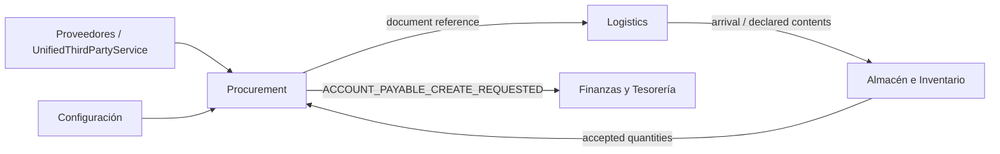
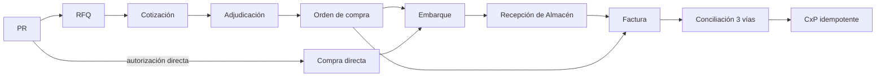
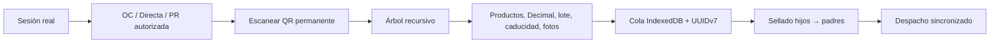

# Procurement and Logistics — cierre técnico

## Resumen ejecutivo

Procurement y Logistics tienen rutas canónicas únicas. Procurement administra el
ciclo comercial; Logistics administra embarques, contenedores, QR, sellos y
custodia; Warehouse/Inventory conserva la recepción física; Finance conserva
CxP y pagos; `proveedores` continúa siendo el maestro único de terceros.

## Bounded contexts



## Flujo comercial



## Compra móvil y contenedores



```text
Contenedor maestro
├── Tarima
│   ├── Caja
│   │   ├── Charola
│   │   └── Charola
│   └── Caja
└── Contenedor térmico
```

## Propiedad y contratos

| Fuente de verdad | Propietario | Contrato consumido |
|---|---|---|
| `proveedores` | Terceros | `SupplierDirectoryQueryService` |
| documentos comerciales/factura | Procurement | referencias UUIDv7 |
| embarques/contenedores/QR | Logistics | `LogisticsShipmentQueryService`, API móvil |
| recepción/stock/calidad | Warehouse/Inventory | eventos de cantidades aceptadas |
| CxP/saldo/pago | Finance | `ACCOUNT_PAYABLE_CREATE_REQUESTED` con clave estructural |

## Permisos principales

| Área | Permisos |
|---|---|
| PR/RFQ | `procurement.requisition.*`, `procurement.rfq.create`, `procurement.quote.capture` |
| OC/directa | `procurement.purchase_order.*`, `procurement.direct_purchase.*` |
| Factura/costos | `procurement.invoice.*`, `procurement.cost.view`, `procurement.cost.edit` |
| Embarques | `logistics.shipment.create`, `logistics.shipment.dispatch`, `logistics.shipment.receive` |
| Contenedores | `logistics.container.scan`, `attach`, `move`, `seal`, `release`, `manage` |

## Estados y eventos

| Agregado | Estados clave |
|---|---|
| PR | DRAFT, SUBMITTED, PENDING_APPROVAL, APPROVED, REJECTED, SOURCED, CANCELLED |
| OC | DRAFT, PENDING_APPROVAL, APPROVED, SENT, ACKNOWLEDGED, RECEIVED, CLOSED |
| Embarque | DRAFT, LOADING, SEALED, DISPATCHED, IN_TRANSIT, RECEIVED, CLOSED |
| Contenedor | AVAILABLE, LOADING, SEALED, IN_TRANSIT, DAMAGED, LOST, RELEASED, RETIRED |

Eventos de integración conservan `event_id`, `causation_id`, `correlation_id` y
`operation_id`. El outbox reintenta, aplica backoff y dead-letter; Finanzas
deduplica CxP por `source_type + source_id`.

## Archivos legacy eliminados

- `modulos/recepcion_qr_widget.py` y `core/services/recepcion_qr_service.py`.
- `application/purchases/` y `core/services/purchase_service.py`.
- `repositories/purchase_*` y repositorios `compras_read/write_repository.py`.
- Página, queries y casos de uso QR duplicados dentro de Procurement.
- Entrada de navegación independiente `compra_directa` y alias duplicados.

## Validación manual

1. Abrir Compras con sesión activa, sucursal y almacén UUIDv7.
2. Recorrer sidebar, filtros, KPIs, alertas, master-detail y tema claro/oscuro.
3. Abrir `/mobile/logistics/` en móvil/tablet, iniciar sesión y seleccionar documento.
4. Escanear raíz e hijos, asignar contenido/fotos, desconectar red y reconectar.
5. Verificar conflicto de versión sin last-write-wins, sellar de abajo hacia arriba y despachar.
6. Confirmar que Recepción vive en Almacén y que Procurement solo muestra referencias.

## Riesgos abiertos

- La validación visual automatizada requiere `libGL.so.1`/runtime gráfico en el agente local.
- Planeación de compras conserva su fase propia y debe conectarse al intake canónico;
  no constituye una ruta alternativa de ejecución de compra.
- La ejecución real de GitHub Actions solo puede observarse después de publicar la rama.

## Evidencia local de pruebas

- Suite cerrada Procurement/Logistics y guardrails de limpieza: 158 passed, 2 skipped.
- `tests/unit` global: 921 passed, 10 skipped y 17 fallos preexistentes de
  Configuración/Productos/migración 099, fuera del alcance de este corte.
- `tests/architecture` global: conserva deuda de Configuración, Finanzas,
  Transferencias y rutas de ejecución dependientes del directorio de trabajo.
- `tests/integration` global no puede recolectar ocho pruebas visuales de Productos
  y Proveedores en este contenedor porque falta `libGL.so.1`; CI instala `libgl1`.

La evidencia anterior se registra sin afirmar falsamente que el CI global está
verde. El workflow ya ejecuta las tres suites obligatorias y hará visibles esos
bloqueos al publicar la rama.

## Confirmación de fuentes únicas

No se creó otro maestro de proveedores, otra recepción, otro stock ni otra CxP.
Las referencias cruzadas son UUIDv7 y cada contexto conserva su propia fuente de verdad.
