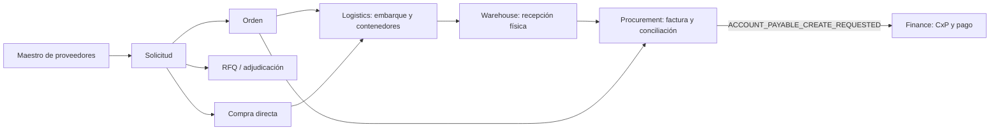

# Fase 8 — cierre verificable de Procurement y Logistics

## Dictamen

El corte queda **cerrado para revisión** con suites explícitas por rol, un recorrido
E2E del documento comercial hasta el único handoff a Finanzas, contratos visuales
reproducibles y pruebas funcionales de la PWA. La ejecución publicada de GitHub
Actions sigue siendo la autoridad para declarar verde el CI remoto; este documento
no sustituye ese resultado ni oculta skips del entorno local.

## Alcance y fuentes únicas

| Dato | Único propietario | Regla de cierre |
|---|---|---|
| Proveedor | Terceros | Procurement consulta el directorio; no replica el maestro. |
| PR, RFQ, OC, compra directa y factura | Procurement | Toda escritura pasa por casos de uso autorizados. |
| Embarque, árbol, QR, evidencia, sello y despacho | Logistics | Procurement conserva solo la referencia comercial. |
| Recepción física, calidad y stock | Warehouse/Inventory | Procurement consume cantidades aceptadas para conciliar. |
| CxP, saldo y pago | Finance | Un único evento deduplicado por factura conciliada. |

## Matriz ejecutable por rol

La matriz usa los códigos canónicos que también consume el backend. Tener permiso
de lectura nunca concede una acción y `logistics.shipment.view` no se infiere de
`PURCHASES_RECEIPT_VIEW`.

| Rol de prueba | Rutas visibles | Acciones sensibles esperadas |
|---|---|---|
| Solicitante | Resumen, Solicitudes | crear y enviar PR; no aprobar |
| Comprador | Resumen, Solicitudes, Órdenes, Nueva compra, Historial | crear/enviar OC y crear directa |
| Aprobador | Resumen, Solicitudes, Órdenes | aprobar PR/OC; no recibir ni conciliar |
| Receptor | Resumen, Órdenes, Recepciones | completar recepción; no facturar |
| Cuentas por pagar | Resumen, Facturas | capturar y conciliar; no aprobar OC |
| Logística de origen | Resumen, Compra en origen | consultar workspace; no recibir mercancía |
| Solo lectura | Resumen | ninguna mutación |

## E2E de aceptación

`test_e2e_requisition_to_single_finance_handoff` ejecuta con SQLite real el camino:

1. crear, enviar y aprobar PR con actores segregados;
2. crear OC ligada a la PR, aprobarla y enviarla;
3. completar la recepción de sus líneas;
4. capturar factura con vínculo a la línea de OC;
5. ejecutar la conciliación real de tres vías; y
6. comprobar exactamente un `ACCOUNT_PAYABLE_CREATE_REQUESTED` con clave
   `SUPPLIER_INVOICE:<id>`.

## Contrato visual

La suite visual construye Compra directa 70/30 y Compra en origen en temas claro y
oscuro, a 1366×768 y 1920×1080. Verifica que controles críticos estén visibles,
con geometría positiva y dentro del viewport, y que los splitters tengan espacio.
En CI guarda ocho PNG y los publica 14 días como artifact
`purchasing-visual-<run_id>`.

El contenedor local de esta revisión no tiene `libGL.so.1`; por ello pytest registra
el módulo como skip antes de importar Qt. Esto es una limitación declarada, no un
resultado visual aprobado. El runner CI instala `libgl1` y convierte la suite y la
generación de evidencia en checks obligatorios.

## PWA y operación offline

Los tests Node ejercitan reglas puras del árbol (hijos antes que padres y rechazo de
ciclos), requisitos de catálogo (peso/lote/caducidad) y precondiciones de despacho
(online, sin conflictos, cola sincronizada y raíces selladas). CI además valida la
sintaxis de todos los módulos JS. La API continúa siendo la autoridad para sesión,
permisos, idempotencia y versión; IndexedDB no se considera fuente de verdad.

## Limpieza legacy y guardrails

La limpieza se limita a los caminos de compras/QR ya sustituidos. Los guardrails
impiden reintroducir `application.purchases`, `purchase_service`,
`recepcion_qr_service`, repositorios `purchase_*` externos o recepción QR dentro de
Procurement. No se eliminó código de otros bounded contexts para maquillar métricas.

## CI de cierre

El job `procurement-logistics-quality` ejecuta, en orden:

1. compilación de Python;
2. guardrails de arquitectura Procurement/Logistics/Purchasing;
3. unidades de ambos dominios, incluida la matriz por rol;
4. integración y E2E de ambos dominios;
5. contratos visuales y carga obligatoria de PNG; y
6. sintaxis y tests Node de la PWA.

Se usan rutas explícitas del dominio: fallos históricos ajenos a este corte no se
silencian con `continue-on-error`, y tampoco pueden bloquear o confundir el estado
de este bounded context.

## Evidencia local del 1 de agosto de 2026

| Comando | Resultado |
|---|---|
| `pytest` de navegación, roles y sesión | 22 passed |
| E2E PR → OC → recepción → factura → CxP | 1 passed |
| `node --test tests/pwa/*.test.mjs` | 3 passed |
| `compileall` del corte | passed |
| contrato visual Qt | 1 skipped: falta `libGL.so.1` local |

## Riesgos residuales y criterio de salida

- **CI remoto:** pendiente hasta que la rama se publique y GitHub Actions finalice.
- **Evidencia visual:** pendiente solo en local; el artifact de CI es obligatorio.
- **Migraciones:** 171–173 deben aplicarse en staging con respaldo antes de producción.
- **Operación:** despacho, reverso y liberación de diferencias conservan segregación
  y requieren pruebas de aceptación con usuarios reales antes del go-live.

El corte puede promoverse cuando el job esté verde, existan los ocho PNG, se haya
validado una migración de staging y los responsables de Compras, Almacén, Logística
y Finanzas firmen el recorrido E2E.
